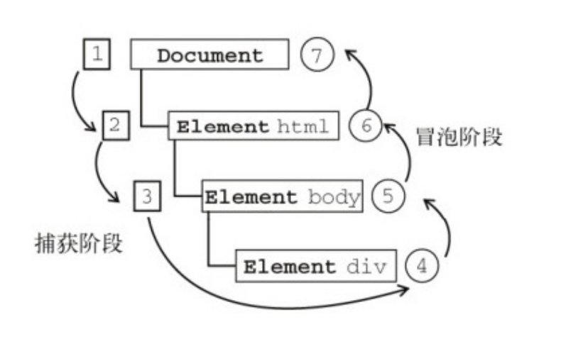

# DOM事件

## 事件级别

- `DOM0`  `dom.onclick = function () {}`
- `DOM2`  `dom.addEventListener(type, listener, useCapture)`
- `DOM3`  `dom.addEventListener(type, listener, useCapture)`

## 事件流

事件流包括三个阶段: 事件捕获阶段(capture phase)、处于⽬标阶段(target phase)和事件冒泡阶段(bubbling phase)



## 自定义事件

```js
// 1. Event
// https://developer.mozilla.org/zh-CN/docs/Web/API/Event/Event

// 创建一个支持冒泡且不能被取消的look事件
let ev = new Event('look', { bubbles: true, cancelable: false })
document.dispatchEvent(ev)
// 事件可以在任何元素触发，不仅仅是document
dom.dispatchEvent(ev)
```

```js
// 2. CustomEvent
// https://developer.mozilla.org/zh-CN/docs/Web/API/CustomEvent

// e.g
// 添加一个适当的事件监听器
document.addEventListener('cat', e => console.log(e.detail))
// 创建并分发事件
let event = new CustomEvent('cat', {
  detail: {
    hazcheeseburger: true
  }
})
document.dispatchEvent(event)
```

