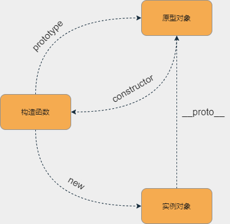

# 原型链

## 创建对象的几种方法

```js
// 1. 字面量
let obj = {name: 'obj'}
let obj = new Object({name: 'obj'})

// 2. 构造函数
function M () {this.name = 'obj'}
let obj = new M()

// 3. Object.create()
let p = {name: 'obj'}
let obj = Object.create(p)
```


## 原型链



```js
// 手写Object.create
Object.create = function (obj) {
  function F () {}
  F.prototype = obj
  return new F()
}
```


## new运算符原理

```js

function _new (fn) {
  // 1. 创建一个空对象, 将这个空对象的原型，指向构造函数的prototype属性
  let O = Object.create(fn.prototype)
  // 2. 执行构造函数
  let res = fn.call(O)
  // 3. 判断执行结果是不是对象
  if (typeof res === 'object' && res !== null){
    return res
  }else {
    return O
  }
}
```

