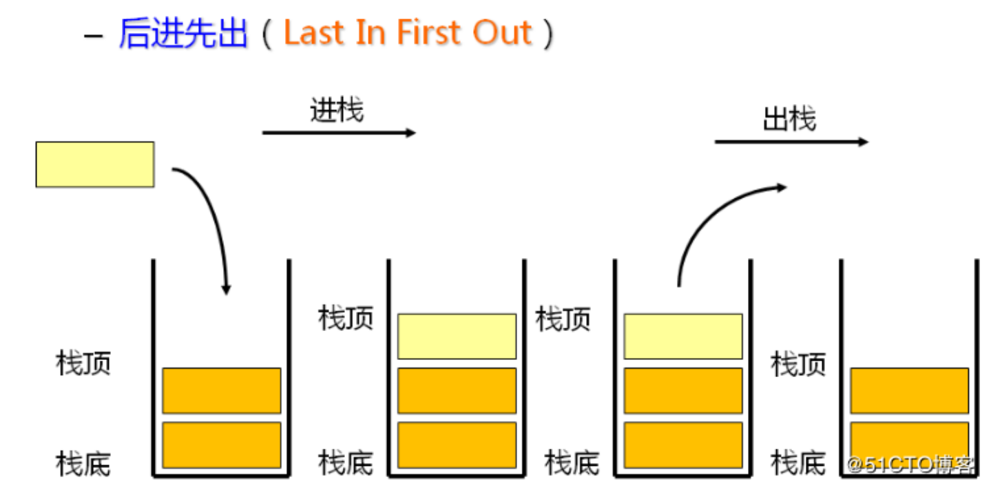

# 数据结构之---栈

## 栈的定义

栈是一种特殊的线性表。**仅能够在栈顶进行操作**，有着**先进后出（后进先出）**的特性。下图展示了栈的工作特点：





生活中有一个非常贴切的例子，玩羽毛球的人都会买一桶羽毛球，羽毛球桶就是典型的栈结构。

每次取羽毛球时，都只能从顶部取，最底下的羽毛球，你是取不到的，用完羽毛球后，也只能从顶部放回去。


## 栈的实现

栈有以下几个方法：

- `push` 添加一个元素到栈顶（向桶里放入一个羽毛球）
- `pop` 弹出栈顶元素（从桶里拿出一个羽毛球）
- `top` 返回栈顶元素，不是弹出（看一眼桶里最顶端的球，但是不拿）
- `isEmpty` 判断栈是否为空（看看羽毛球是否用完了）
- `size` 返回栈里元素的个数（数一下桶里还有多少羽毛球）
- `clear` 清空栈（把桶里的羽毛球都扔掉）

完整代码：

```js
class Stack {
  #items = []

  // 入栈
  push ( item ) {
    this.#items.push(item)
  }

  // 出栈
  pop () {
    return this.#items.pop()
  }

  // 栈顶
  top () {
    return this.#items[this.#items.length - 1]
  }

  // 判断是否为空栈
  isEmpty () {
    return this.#items.length === 0
  }

  // 大小
  size () {
    return this.#items.length
  }

  // 清空栈
  clear () {
    this.#items = []
  }
}
```


## 应用练习

1. 下面字符串中包含小括号，检验括号的合法性（是否成对出现）

```txt
sdf(ds(ew(we)rw)rwqq)qwewe
(sd(qwqw)sd(sd))
()(sd)(()
```

思路: 

 遍历字符串的每个字符，对每个字符做以下操作：

- 遇到左括号，把左括号压入栈中
- 遇到右括号，判断栈是否为空，为空说明没有左括号与之对应，缺少左括号，字符串括号不合法；如果不为空，则把栈顶元素移除，这对括号就抵消了

当遍历结束后，如果栈是空的，说明所有括号都已经抵消掉了，如果栈里还有元素，说明缺少右括号，字符串括号不合法


代码实现：

```js
function test_str ( str ) {
  let stack = new Stack()

  for (let i = 0; i < str.length; i++) {
    let item = str[i]

    // 遇左括号压入栈中
    if (item === '(') {
      stack.push(item)
    } else if (item === ')') {
      // 如果为空, 说明没有左括号与之抵消
      if (stack.isEmpty()) {
        return false
      } else {
        // 弹出栈顶
        stack.pop()
      }
    }
  }

  return stack.size() === 0
}

console.log('============合法字符串===========')
console.log(test_str('sdf(ds(ew(we)rw)rwqq)qwewe'))
console.log(test_str('(sd(qwqw)sd(sd))'))
console.log(test_str('()(sd)(()'))
console.log('============合法字符串===========')
```


2. 后缀表达式计算

```txt
[ '4', '13', '5', '/', '+' ] 等价于 4 + ( 13 / 5 )
```

思路：

遍历数组，对每个元素做以下操作：

- 如果元素不是 `+` `-` `*` `/` 中的某一个，则压入栈中
- 如果元素是 `+` `-` `*` `/` 中的某一个，则从栈里连续弹出两个元素，对这两个元素进行计算，将计算后的值压入栈中

遍历结束后，栈里只有一个元素，这个元素就是整个表达式的计算结果


代码实现：

```js
function calc_exp ( exp ) {
  let stack = new Stack()

  for (let i = 0; i < exp.length; i++) {
    let item = exp[i]

    if ([ '+', '-', '*', '/' ].indexOf(item) !== -1) {
      // 从栈顶弹出两个元素
      let v1 = stack.pop()
      let v2 = stack.pop()

      // 计算两个元素的值
      let res = parseFloat(eval(`${ v2 }${ item }${ v1 }`))

      // 把计算结果压入栈中
      stack.push(res)
    } else {
      stack.push(item)
    }
  }

  // 表达式如果是正确的, 则最终栈⾥只有⼀个元素, 且正是表达式的计算结果
  return stack.pop()
}

console.log('============后缀表达式计算===========')
console.log(calc_exp([ '4', '13', '5', '/', '+' ]))
console.log('============后缀表达式计算===========')
```


3. 实现一个有 `min` 方法的栈，且时间复杂度为 `o(1)`

思路：

使用两个栈来存储数据，一个存储普通数据，一个专门存储最小值数据


代码实现：

```js
class MinStack {
  #data_stack = new Stack() // 只存储数据
  #nin_stack = new Stack() // 只存储最小值

  push ( item ) {
    // 数据栈正常push
    this.#data_stack.push(item)

    // 最小值栈
    // 如果min_stack为空或者item小于min_stack的栈顶元素，则压入栈中
    // 保证min_stack的栈顶始终存储栈的最小值
    if (this.#nin_stack.isEmpty() || item < this.#nin_stack.top()) {
      this.#nin_stack.push(item)
    } else {
      // 如果item大于或等于栈顶元素，则把min_stack的栈顶元素再放入一次
      // 保证min_stack的元素个数和data_stack的一致
      // 保证pop的正确性
      this.#nin_stack.push(this.#nin_stack.top())
    }
  }

  pop () {
    // pop时，两个都pop
    this.#data_stack.pop()
    this.#nin_stack.pop()
  }

  min () {
    // 直接取栈顶元素
    return this.#nin_stack.top()
  }
}

console.log('============最小值===========')
let minStack = new MinStack()

minStack.push(3)
console.log('push 3')
minStack.push(6)
console.log('push 6')
minStack.push(9)
console.log('push 9')
console.log('当前最小值为: ', minStack.min())
minStack.push(2)
console.log('push 2')
console.log('当前最小值为: ', minStack.min())
minStack.pop()
console.log('pop once')
console.log('当前最小值为: ', minStack.min())
console.log('============最小值===========')
```

