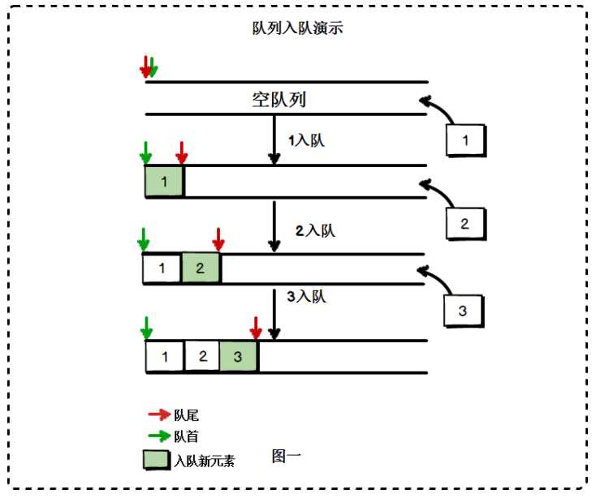
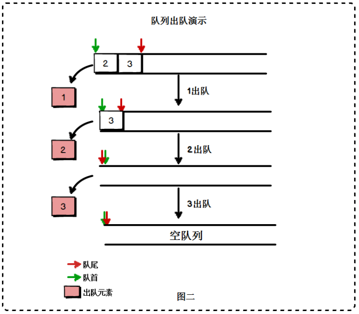

# 数据结构之---队列

## 定义

队列是一种特殊的线性表，其特殊之处在于，只允许在队列的头部删除元素，在队列的尾部添加元素

下图展示了队列的工作过程





日常生活中，排队就是典型的队列结构


## 代码实现

```js
class Queue {
  // 数据存储
  #items = []

  // 从尾部添加元素
  enqueue ( item ) {
    this.#items.push(item)
  }

  // 从头部删除元素
  dequeue () {
    return this.#items.shift()
  }

  // 判断队列是否为空
  isEmpty () {
    return this.#items.length === 0
  }

  // 返回队列大小
  size () {
    return this.#items.length
  }

  // 返回头部元素
  head () {
    return this.#items[0]
  }

  // 返回队列尾节点
  tail () {
    return this.#items[this.#items.length - 1]
  }
}
```


## 应用练习

