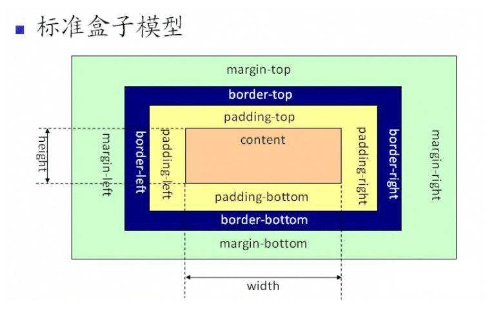
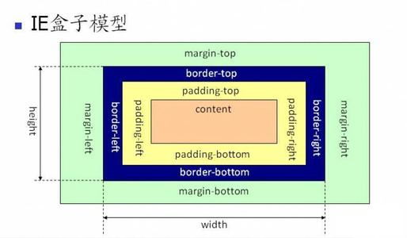

# CSS盒模型

## 定义

盒模型由`content`（内容）、`padding`（内边距）、`border`（边框）、`margin`（外边距）组成






```css
box-sizing: content-box; // 标准盒模型，浏览器默认值
box-sizing: border-box; // 怪异盒模型
```


## BFC（Block Formatting Context）


满足下列条件之一就可触发BFC: 

- 根元素，即 `HTML` 元素
- `float` 的值不为 `none`
- `overflow` 的值不为 `visible`
- `display` 的值为 `inline-block` 、`table-cell` 、`table-caption`
- `position` 的值为 `absolute` 或 `fixed`


作用
- 防止边距重叠

- 清除浮动